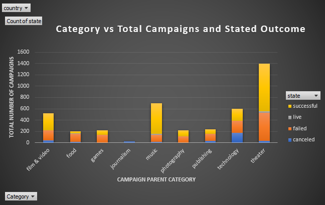
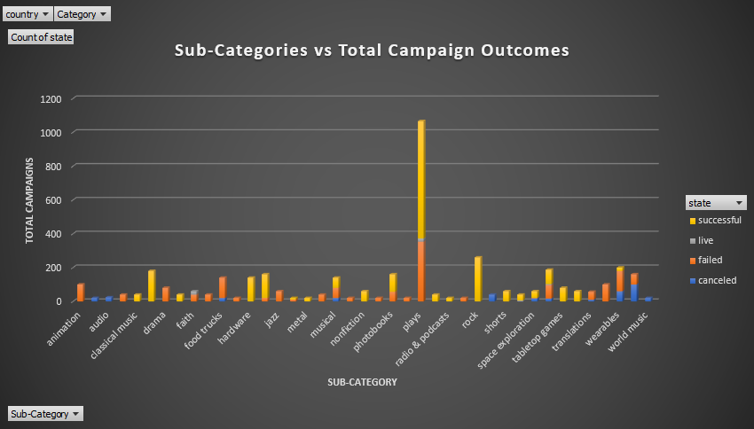
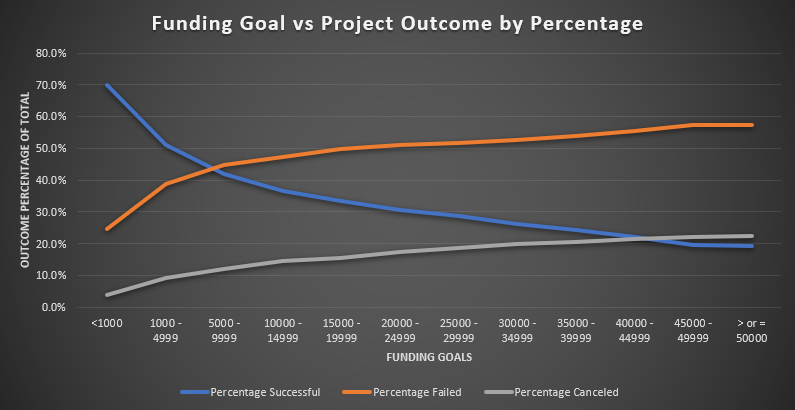

# kickstarter_excel_2020
Key Interpretations from the analysis of Kickstarter Campaigns
1.	While more Kickstarter campaigns are opened in the summer months which also shows higher successes and failures, the data suggests that a Kickstarter opened late Fall/early Winter (December & January) will be less successful. However, once February starts, there’s a noticeable uptick in success and decrease in failure. The data also suggests that theatre accounts for the largest crowd-funded category, with plays being the largest subcategory by far. Crowd-funding for music through Kickstarter has a higher likelihood of success, while Kickstarter campaigns for food have a higher tendency toward failure.
2.	The dataset does not detail the reasons for failure or cancellation, or show how the campaign was promoted; how active was the creator in promoting their project for funding. While the dataset shows the number of backers for each project and we can deduce a possible average donation per backer, it does not show median or mode. We cannot see the most likely amount backers were willing to give to a project and we are unable to see if there are outliers in money given. We are unable to see if certain projects had backers that provided the bulk sum of the goal amount needed or if there were organizations that may have matched pledges. The dataset shows deadlines, but does not specify if that date reflects canceled ventures. Is it possible that some of the canceled Kickstarter campaigns ended long before reaching the deadline date?
3.	One of the areas we can examine in more depth would be initial date and deadline date vs success and failure. What may be the optimal length of time to keep a campaign live to ensure success? The dataset shows if the campaign was staff picked or not; we could determine if the rate of success is affected by whether the campaign was staff-picked or not. We can also look at percent funded with the categories/subcategories. This may help us see how robust some successes are within categories/subcategories.

Other Key Insights
1.	Both Mean and Median show stark differences between Successful and Failed Campaigns. When looking at the other statistics, such as Mode, Minimum, Maximum, Standard Deviation, I would say the Median is a much more reliable indicator rather than mean. For instance, the standard deviation of backers in successful campaigns is over 800 and the maximum number of backers is over 26,000 people (this would most likely be considered an outlier). These figures show excessive variation in the data for successful campaigns. The median shows a number that seems to be more representative of typical successful campaigns, 62 backers. The mode of successful campaigns supports this assertion showing 27 as the most typical number of backers for a successful crowd-funded campaign. Conversely, I would choose the mean number of backers as the better indicator for failed campaigns. There’s a large number of failed campaigns with zero backers (0 in this case is not an outlier since it is also the mode). The spread of data for failed campaigns is tighter, showing less variation and a much smaller standard deviation. The mean in this case takes into account the data set and shows a much more representative number. The medians seems to be skewed largely to the smaller end due a long list of few backers.
2.	Successful campaigns show a high degree of variability, which is larger than the variability of failed campaigns by orders of magnitude. The variability for successful campaigns is due to myriad factors, including variation in goals, variation in project interest, and variation of degrees of success. There are many successful campaigns that not only reached their goals, but surpassed funding goals by even over 200%. Even looking at the minimum and maximum number of backers in successful campaigns, you can see a gargantuan difference; one successful campaign had over 26K backers and another successful campaign had 1. Compared with failed campaigns, we’re also seeing a difference by orders of magnitude between the max and min. 

Examples of graphs from pivot tables within KickStarter_Analysis Excel Spreadsheet

